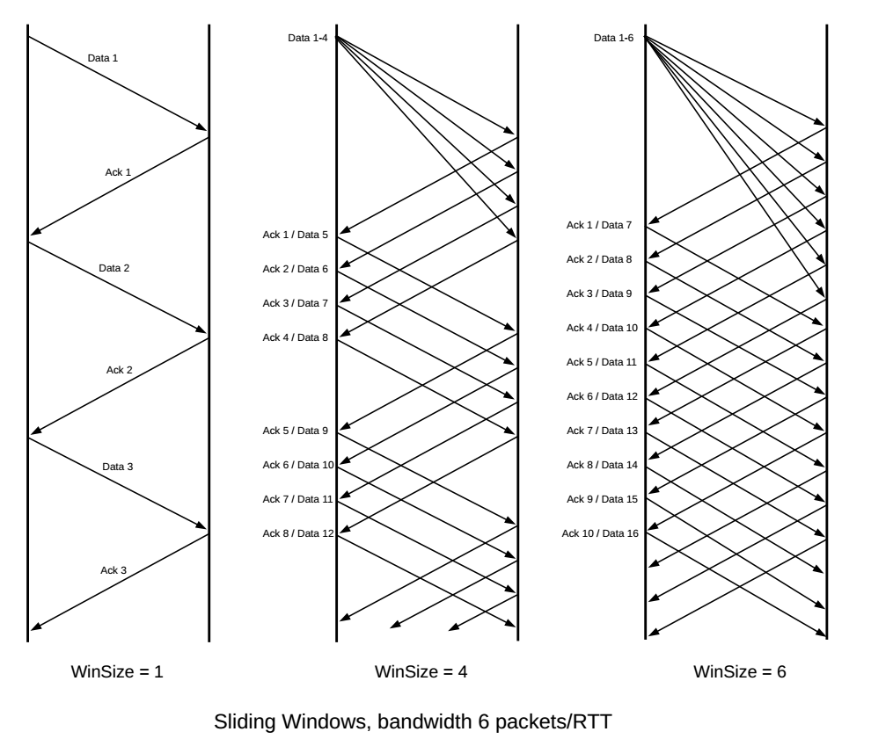
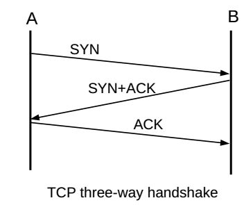
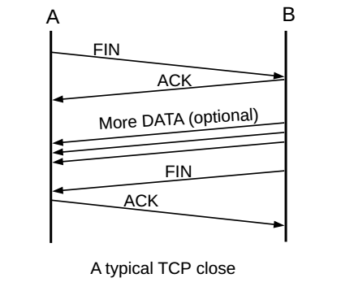

_Self study notes taken from lecture slides_

# Intro to Computer Networks Textbook
*2nd Edition, Sept 01, 2020*
*Author: Peter Dordal (Loyola University Chicago)*

1. An Overview of Networks
2. 
3. 

## Chapter 1: An Overview of Networks

### 1.1 Layers

Local Area Networks, or LANs, are the “physical” networks that provide the connection between machines within, say, a home, school or corporation. LANs are, as the name says, “local”; it is the IP, or Internet Protocol, layer that provides an abstraction for connecting multiple LANs into, well, the Internet. Finally, TCP deals with transport and connections and actually sending user data.

LANs, IP and TCP – are often called layers; they constitute the Link layer, the Internetwork layer, and the Transport layer respectively. Together with the Application layer (the software you use), these form the “four-layer model” for networks.

Dividing the LAN layer into physical/logical subdivision gives us the Internet five-layer model.

We will also introduce two more rather obscure layers that complete the seven-layer model.

### 1.2 Data Rate, Throughput and Bandwidth

Data rate
> the rate at which bits are transmitted. In some LANs (eg Wi-Fi) the data rate can vary with time. 

Throughput
> refers to the overall effective transmission rate, taking into account things like transmission overhead, protocol inefficiencies and perhaps even competing traffic.

Goodput
>  is sometimes used to refer to what might also be called “application-layer throughput”: the amount of usable data delivered to the receiving application.

Data rates are generally measured in kilobits per second (kbps) or megabits per second (Mbps); the use of the lower-case “b” here denotes bits. In contrast, data volumes are denoted using kB and MB, with the upper-case B denoting bytes.

### 1.3 Packets

Packets
> are modest-sized buffers of data, transmitted as a unit through some shared set of links.

Packets need to be prefixed with a **header** containing delivery information. In the common case known as **datagram forwarding**, the header contains a **destination address**. Almost all networking today is packet-based.

Maximum packet size supported by a given LAN (eg Ethernet, Token Ring or ATM) is an intrinsic attribute of that LAN. Ethernet allows a maximum of 1500 bytes of data. By comparison, TCP/IP packets originally often held only 512 bytes of data.

Generally each layer adds its own header. Ethernet headers are typically 14 bytes, IP headers 20 bytes, and TCP headers 20 bytes.

### 1.4 Datagram Forwarding

Switches or routers to look at the address in the packet's headers to get the packet to the correct destination.

In datagram forwarding this is achieved by providing each switch with a forwarding table of [destination,next_hop] pairs.

The switch also finds the **next_hop**
> the immediate-neighbor address to which – or interface by which – the packet should be forwarded in order to bring it one step closer to the final destination.The next_hop value in a forwarding table is a single entry; **each switch is responsible for only one step in the packet’s path**.

The “destination” entries in the forwarding table do not have to correspond exactly with the packet destination addresses, for Ethernet datagram forwarding they correspond. But for IP routing, the table “destination” entries will correspond to **prefixes** of IP addresses; this leads to a huge savings in space. The fundamental requirement is that the switch can perform a lookup operation, using its forwarding table and the destination address in the arriving packet, to determine the next hop.

A central feature of datagram forwarding is that each packet is forwarded “in isolation”; the switches involved do not have any awareness of any higher-layer logical connections established between endpoints. This is also called stateless forwarding, in that the forwarding tables have no per-connection state.

The fundamental alternative to datagram forwarding is **virtual circuits**
> In virtual-circuit networks, each router maintains state about each connection passing through it; different connections can be routed differently.

Switches
> devices acting at the LAN layer and forwarding packets based on the LAN address

Routers
> devices acting at the IP layer and forwarding on the IP address

Datagram forwarding is used both by Ethernet switches and by IP routers. The destinations in Ethernet forwarding tables are individual nodes while the destinations in IP routers are entire networks (that is, sets of nodes).

### 1.5 Topology

If there are no loops in a network graph/diagram then there is no redundancy: any broken link will result in partitioning the network into two pieces that cannot communicate. All else being equal (which it is not, but never mind for now), redundancy is a good thing.

Many LANs (in particular Ethernet) prefer “tree” networks with no redundancy, while IP has complex protocols in support of redundancy.

### 1.5.1 Traffic Enginner

Traffic engineering
> refer to any intentional selection of one route over another, or any elevation of the priority of one class of traffic.

Datagram forwarding can be extended to take quality-ofservice information into account; this may be used to have voice traffic – with its relatively low bandwidth but intolerance for delay – take an entirely different path than bulk file transfers.

The quality-of-service information may be set by the end-user, in which case an ISP may wish to recognize it only for designated users, which in turn means that the ISP will implicitly use the traffic source when making routing decisions. Alternatively, the quality-of-service information may be set by the ISP itself, based on its best guess as to the application;

### 1.6 Routing Loops

A potential drawback to datagram forwarding is the possibility of a **routing loop**:
>  a set of entries in the forwarding tables that cause some packets to circulate endlessly.

Routing loops typically arise because the creation of the forwarding tables is often “distributed”, and there is no global authority to detect inconsistencies. Even when there is such an authority, temporary routing loops can be created due to notification delays.

All datagram-forwarding protocols need some way of detecting and avoiding routing loops.

Ethernet, for example, avoids nonlinear routing loops by disallowing loops in the underlying network topology, and avoids linear routing loops by not having switches forward a packet back out the interface by which it arrived.

IP provides for a one-byte “Time to Live” (TTL) field in the IP header; decreases by 1 at each router, packet is discarded when TTL counter reaches 0. This limits the number of times a wayward packet can be forwarded to the initial TTL value, typically 64.

A switch is responsible only for the next hop to the ultimate destination; if a switch has a complete path in mind, there is no guarantee that the next_hop switch or any other downstream switch will continue to forward along that path.

### 1.7 Congestion

Congestion
> Switches introduce the possibility of congestion: packets arriving faster than they can be sent out.

Causes of congestion
- if the inbound interface has a higher bandwidth than the outbound interface
- traffic arriving on multiple inputs and all destined for the same output

A queue will form if packets arrive faster than they can be sent. If queue is full, packets will be **dropped**. 

### 1.8 Packets again

The main benefit of packets: The same link can carry, at different times, different packets representing traffic to different destinations and from different senders.

When a router or switch receives a packet, it reads in the entire packet before looking at the header and decide which node to forward it. THis is known as **Store and forward** and introduces a **forwarding delay** equal to time needed to read the entire packet. 

Total packet delay is the sum of: bandwidth delay (per link), propagation delay (speed of light), store-and-forward delay, queueing delay. 

### 1.9 LAN and Ethernet

Local Area Network
> physical links that are ultimately serial lines. common interfacing hardward connecting the hosts to the links. protocols to make everything work together.

The most common type of (wired) LAN is Ethernet, nowadays most Ethernet operates at 100 Mbps.

Due to both privacy and efficiency concerns, almost all Ethernets today are fully switched; this ensures that each packet is delivered only to the host to which it is addressed.

Ethernet also has a designated broadcast address. A host sending to the broadcast address has its packet received by every other host on the network; broadcast mechanism allows host A to contact host B when A does not yet know B’s physical address. 

Traffic addressed to a particular host – that is, not broadcast – is said to be unicast.

Switched Ethernet works quite well, however, for networks with up to 10,000-100,000 nodes. Forwarding tables (list of all node addresses) with size in that range are straightforward to manage.

### IP - Internet Protocol

To solve the scaling problem with Ethernet, the Internet Protocol was developed. IP was meant to support universal connectivity, without resulting in unmanageably large forwarding tables (currently the largest tables have 300,000 entries).

IP provides a global mechanism for **addressing and routing**, so that packets can actually be delivered from any host to any other host. IP addresses are part of the IP header. 

An essential feature of IP addresses is that they can be divided into a network part (prefix) and a host part (the remainder.)

IP addresses need to be assigned by administrative group. 

The network portion of an IP address is sometimes called the network number or network address or network prefix. As we shall see below, most forwarding decisions are made using only the network prefix.

All hosts with the same network address (same network bits) are said to be on the same IP network and must be located together on the same LAN; Thus we assume that if two hosts share the same network address they can reach each other directly.

IP is a best effort system; there are no IP-layer acknowledgments or retransmissions. We ship the packet and hope it gets there. best-effort model represents what is known as connectionless networking: the IP layer does not maintain information about endpoint-to-endpoint connections, and simply forwards packets like a giant LAN.

The alternative could have been some form connection-oriented internetworking, in which routers do maintain state information about individual connections.

Connectionless networking is conceptually more reliable: if routers do not hold connection state, then they cannot lose connection state. The primary advantage of connection-oriented networking, on the other hand, is that the routers are then much better positioned to accept reservations and to make quality-of-service guarantees. This is somewhat neglected in current internet. Packets are treated by the Internet just the same as any other file. No priority service option.

The most common form of IP packet loss is router queue overflows, representing network congestion. A large number of hosts can simultaneously attempt to send traffic through one router. 

### 1.10.1 IP Forwarding

The “destination” values listed in the forwarding tables of IP routers are network prefixes – representing entire LANs – instead of individual hosts. The goal of IP forwarding, then, becomes delivery to the correct LAN; A separate process is used to deliver to the final hosts once the final LAN is reached.

**Routers need to list only the network prefixes** of the destination addresses in their IP forwarding tables. This strategy is the key to IP scalability: it saves large amounts of forwarding-table space, it saves time as smaller tables allow faster lookup, and it saves the bandwidth and overhead that would be needed for routers to keep track of individual addresses.

Suppose A is the sending host, sending a packet to a destination host D. The first step is for A to determine whether D is on the same LAN as itself or not, that is whether D is local. If D is in the same LAN network, it sends the packet via LAN. 

If, D is not in the same local network as A, then A looks up a router to use. Most ordinary hosts only use one router for all non-local packet deliveries, making this choice simple. The router first checks to see if any of its network interfaces are on the same LAN as D; recall that the router connects to at least one additional network besides the one for A. If the answer is yes, then the router uses direct LAN delivery to the destination, as above. If, on the other hand, Dnet is not a LAN to which the router is connected directly, then the router consults its internal forwarding table.
This consists of a list of networks each with an associated next_hop address.

The next_hop addresses in the table are chosen so that the router can always reach them via direct LAN delivery via one of its interfaces; generally they are other routers.

The packet continues being forwarded like this, from router to router, until it finally arrives at a router that is connected to D's network; it is then delivered by that final router directly to D, using the LAN.

**One can think of the network-prefix bits as analogous to the “zip code” on postal mail, and the host bits as analogous to the street address. The internal parts of the post office get a letter to the right zip code, and then an individual letter carrier (the LAN) gets it to the right address.**

The Internet backbone as those IP routers that specialize in large-scale routing on the commercial Internet, and which generally have forwarding-table entries covering all public IP addresses; while there are many private IP networks, there are about 800,000 separate network prefixes (as of 2019) visible to the backbone.

If a destination does not match any locally assigned network prefix, the packet needs to be routed out into the Internet at large; for typical non-backbone sites this almost always this means the packet is sent to the ISP that provides Internet connectivity.

**The Internet can be seen as a combination of end-user LANs together with point-to-point links joining these LANs to the backbone**

### 1.10.2 Future of IPv4

THe Internet Assigned Numbers Authority (IANA) of North America (ARIN) ran out of its pool of IPv4 addresses. This may accelerate implementation of IPv6 which has 128-bit addresses instead of the 32-bit (i.e. 32 zeroes and ones) of IPv4

### 1.11 DNS Domain Name System

IP addresses are hard to remember (nearly impossible in IPv6). The domain name system, or DNS (10.1 DNS), comes to the rescue by creating a way to convert hierarchical text names to IP addresses. Thus, for example, one can type www.luc.edu instead of 147.126.1.230.

All Internet software uses the same basic library calls to convert DNS names to IP addresses. 

### 1.12 Transport

Far and away the most popular mechanism in the Transport layer is the Transmission Control Protocol, or TCP. TCP extends IP with the following:

- reliability: TCP numbers each packet, and keeps track of which are lost and retransmits them after a timeout.

- connection-orientation: Once a TCP connection is made, an application sends data simply by writing to that connection.

TCP endpoints are of the form xhost,porty; these pairs are known as socket addresses, Servers (or, more precisely, server applications) listen for connections to sockets they have opened; the client is then any endpoint that initiates a connection to a server.

When you enter a host name in a web browser, it opens a TCP connection to the server’s port 80 (the standard web-traffic port), that is, to the server socket with socket-address (server,80). A busy server may have thousands of connections to its port 80 (the web port) and hundreds of connections to port 25 (the email port). Web and email traffic are kept separate by virtue of the different ports used. All those clients to the same port, though, are kept separate because each comes from a unique (host,port) pair.

That is, there may be multiple independent connections to (www.luc.edu,80). This is somewhat analogous to certain business telephone numbers of the “operators are standing by” type, which support multiple callers at the same time to the same toll-free number. Each call to that number is answered by a different operator (corresponding to a different cpu process), and different calls do not “overhear” each other.

TCP uses the sliding-windows algorithm to keep multiple packets en route at any one time. If the window size is 10 packets, for example, then at any one time 10 packets are in transit (perhaps 5 data packets and 5 returning acknowledgments). As each acknowledgment arrives the window “slides forward” by one packet.

The ideal window size, at least from a throughput perspective, is such that it takes one round-trip time to send an entire window, TCP approximates the ideal size. Window size is slowly raised until packet loss occurs, which TCP takes as a sign that it has reached the limit of available network resources. At that point the window size is reduced to half its previous value, and the slow climb resumes. This maximizes bandwidth while limiting number of packet lost. 

TCP has come to be the Internet protocol charged with reducing (or at least managing) congestion on the Internet, and – relatedly – with ensuring fairness of bandwidth allocations to competing connections.

The real-time performance of TCP is not always consistent: if a packet is lost, the receiving TCP host will not turn over anything further to the receiving application until the lost packet has been retransmitted successfully; this is often called head-of-line blocking.

alternative to TCP is known as UDP, for User Datagram Protocol. UDP omits the other TCP features: there is no connection setup, no lost-packet detection, no automatic timeout/retransmission, the absence of connection setup means data transmission can get started faster, and the absence of lost-packet detection means there is no head-of-line blocking.

### 1.12.1 Transport Communication Patterns

TCP in streaming video works by buffering the video that has been received but not yet viewed. That way, if there is a dip in throughput due to congestion, the receiver has time to recover. Most streaming-video services estimate available throughput then adapt to it by changing video resolution.

If the video (or, for that matter, voice audio) is interactive, there is much less opportunity for stream buffering. In this case User Datagram Protocol (UDP) is often used to avoid head-of-line blocking (in TCP when packet is lost, the TCP host will not turn over anything until the lost packet has been retransmitted successfully).  

Within the Transport layer, essentially all network connections involve a client and a server. Often this pattern is repeated at the Application layer as well: the client contacts the server and initiates a login session, or browses some web pages, or watches a movie.

### 1.12.2 Content-Distribution Networks

Sites with an extremely large volume of content to distribute often turn to a specialized communication pattern called a content-distribution network (CDN). To reduce the amount of long-distance traffic, or to reduce the round-trip time, a site replicates its content at multiple datacenters (also called Points of Presence (PoPs), nodes, access points or edge servers). When a user makes a request (eg for a web page or a video), the request is routed to the nearest (or approximately nearest) datacenter, and the content is delivered from there.

Large web pages typically contain both static content and also individualized dynamic content. The CDN may cache all or most of the static content at each of its edge servers, leaving the dynamic content to come from a centralized server. Alternatively, the dynamic content may be replicated at each CDN edge node as well. 

All that is needed to create a CDN is a multiplicity of datacenters, each with its own connection to the Internet; private links between datacenters are also common.

Finding the edge server that is closest to a given user is a tricky issue. There are three techniques in common use. In the first, the edge servers are all given different IP addresses, and DNS is configured to have users receive the IP address of the closest edge server. In the second, each edge server has the same IP address, and anycast routing is used to route traffic from the user to the closest edge server. Finally, for HTTP applications a centralized server can look up the approximate location of the user, and then redirect the web page to the closest edge server.

### 1.13 Firewalls

One problem with having a program on your machine listening on an open TCP port is that someone may connect and then, using some flaw in the software on your end, do something malicious to your machine.

A firewall is a mechanism to block connections deemed potentially risky, eg those originating from outside the site.

### 1.14 Useful Utilities

Ping is useful to determine if another machine is accessible. e.g. `ping www.google.com` , ` ping 147.123.1.230` 

To find your own IP address you can use `ifconfig` on Linux.

`host www.google.com` is used for DNS lookup to check IP addresses.
`traceroute www.google.com` lists the route from you to a remote host.

## 2. Ethernet Basics

Ethernet consisted of a long piece of cable (possibly spliced by repeaters). When a station transmitted, the data went everywhere along that cable. Such an arrangement is known as a broadcast bus;

However, between each station CPU and the cable there was a peripheral device (that is, a card) known as a **network interface**, which would take care of the details of transmitting and receiving. The network interface would (and still does) decide when a received packet should be forwarded to the host, via a CPU interrupt.

Whenever two stations transmitted at the same time, the signals would collide, and interfere with one another; both transmissions would fail as a result. Proper handling of collisions was an essential part of the access-mediation strategy for the shared medium. In order to minimize collision loss, each station implemented the following: 
1. Before transmission, wait for the line to become quiet 
2. While transmitting, continually monitor the line for signs that a collision has occurred; if a collision is detected, cease transmitting 
3. If a collision occurs, use a backoff-and-retransmit strategy 

These properties can be summarized with the CSMA/CD acronym: Carrier Sense, Multiple Access, Collision Detect.

## 4. Wireless LANS

Ethernet-like collision detection is no longer feasible over radio. With radio the remote signal might easily be as little as 1/1,000,000 of the
transmitted signal (-60 dB), compared to 1/100 when transmitting over wire in Ethernet.

In wireless communication, two nodes A and B that are not in range of one another – and thus cannot detect one another – may still have their signals interfere at a third node C. If A and B transmit simultaneously then there will be a collsion at C, but neither A nor B can possibly detect this.

“band width” (two words) means the frequency range used by a signal, not the data transmission rate.

Data rate achievable with a radio signal is proportional to the channel width. “channel width” or “width of the frequency band” for the frequency range, as “band width” is easily mistaken for “bandwidth”.

Higher data rates require wider frequency bands.

A signal may reach a receiver through a line-of-sight path and also several reflected paths, possibly of varying length. In addition to reflection, the signal may be subject to reflectionlike scattering and diffraction. All of this together is known as multipath interference. Multipath interference tends to lead to wide fluctuations in signal intensity with a period of about half a wavelength;

The Wi-Fi standard has provisions for minimizing power usage by allowing a device to “doze” most of the time, waking periodically to check if any packets are ready to be sent to it. The low-power Bluetooth wireless standard is commonly used as a cable alternative for things like computer mice and telephone headsets. Bluetooth is also a low-power network; for many applications the working range is about 10 meters.

Wi-Fi is designed to interoperate freely with Ethernet at the logical LAN layer. Wi-Fi LAN attached to an Ethernet LAN looks like an extension of the Ethernet LAN.

Traditionally, Wi-Fi used the 2.4 GHz ISM (Industrial, Scientific and Medical) band used also by microwave ovens,  the new 802.11ac has returned to using 5 GHz exclusively. The 5 GHz band has reduced ability to penetrate walls, often resulting in a lower effective range (though in offices and multi-unit housing this can be an advantage). The 5 GHz band provides many more usable channels than the 2.4 GHz band, resulting in much less interference in “crowded” environments.

There are almost 200 5 MHz channels in the 5 GHz band. The United States requires users of the this band to avoid interfering with weather and military applications in the same frequency range; One Wi-Fi sender, however, needs several of these official channels; the typical 2.4 GHz 802.11g transmitter uses an actual frequency range of up to 22 MHz, or up to five official channels.

Wi-Fi transmitting stations simply cannot detect collisions in progress. If another station transmits at the same time, a Wi-Fi sender will see nothing amiss although its signal will not be received.

Wi-Fi Collision Avoidance strategy: Any sender wanting to send a new data packet waits the IFS time after first sensing the medium to see if it is idle. if other traffic is sensed, the sender must do an exponential backoff even for its first transmission attempt; other stations, after all, are likely also waiting, and avoiding an initial collision is strongly preferred.

On an Ethernet, if two stations are waiting for a third to finish before they transmit, they will both transmit as soon as the third is finished and so there will always be an initial collision. With Wi-Fi, because of the larger initial k<32 backoff range, such initial collisions are unlikely. If a Wi-Fi sender believes there has been a collision, it retries its transmission, after doubling the backoff range to 64, then 128, 256, 512, 1024 and again 1024 (exponential backoff strategy). If these seven attempts all fail, the packet is discarded and the sender starts over.

## 5. Virtual Private Networks

Your home computer creates an ordinary Internet connection (TCP or UDP) to a workplace VPN server. Each end of the connection is typically associated with a software-created virtual network interface; each of the two virtual interfaces is assigned an IP address. When a packet is to be sent along the virtual link, it is actually encapsulated and sent along the original Internet connection to the VPN server, wending its way through the commodity Internet; this process is called tunneling.

Tunneled packets are often encrypted as well as encapsulated.

Other applications of VPNs include trying to appear geographically to be at another location, and bypassing firewall rules blocking specific TCP or UDP ports.

## 8.2 Sliding window algorithm

Retransmit-on-timeout policy; that is, if a packet is transmitted and there is no acknowledgment received during the timeout interval then the packet is resent. reliability, we also want to keep as many packets in transit as the network can support. The strategy used to achieve this is known as sliding windows.

The sender picks a window size, winsize. The basic idea of sliding windows is that the sender is allowed to send this many packets before waiting for an ACK (acknowledgement which is sent from the receiver back to the sender to let it know that packet has been received.

The sender keeps a state variable last_ACKed, representing the last packet for which it has received an ACK from the other end;

Larger sender winsize causes Data[N] to arrive faster.

## 16. UDP transport

User Datagram Protocol. UDP headers consists of source port, destination port, and checksums. 

The port numbers are what makes UDP into a real transport protocol: with them, an application can now connect to an individual server process (that is, the process “owning” the port number in question), rather than simply to a host.

UDP is unreliable, in that there is no UDP-layer attempt at timeouts, acknowledgment and retransmission; applications written for UDP must implement these. As with TCP, a UDP [host,port] pair is known as a socket. 

UDP is also unconnected, or stateless; if an application has opened a port on a host, any other host on the Internet may deliver packets to that xhost,porty socket without preliminary negotiation.

UDP is also unconnected, or stateless; if an application has opened a port on a host, any other host on the Internet may deliver packets to that xhost,porty socket without preliminary negotiation.

UDP is also popular for **real-time transport**; the issue here is head-of-line blocking. If a TCP packet is lost, then the receiving host queues any later data until the lost data is retransmitted successfully, which can take several RTTs; there is no option for the receiving application to request different behavior. UDP, on the other hand, gives the receiving application **the freedom simply to ignore lost packets**. This approach is **very successful for voice and video**, which are **loss-tolerant** in that small losses simply degrade the received signal slightly, but **delay-intolerant** in that packets arriving too late for playback might as well not have arrived at all. Similarly, in a computer game a lost position update is moot after any subsequent update. **Loss tolerance is the reason the Real-time Transport Protocol, or RTP, is built on top of UDP rather than TCP**.

## 17. TCP Transport Basics

The standard transport protocols riding above the IP layer are TCP and UDP. UDP provides simple datagram delivery to remote sockets, that is, to xhost,porty pairs. TCP provides a much richer functionality for sending data to (connected) sockets.

TCP is stream-oriented, meaning that the application can write data in very small or very large amounts and the TCP layer will take care of appropriate packetization.

TCP is connection-oriented, meaning that a connection must be established before the beginning of any data transfer. TCP is reliable, in that TCP uses sequence numbers to ensure the correct order of delivery and a timeout/retransmission mechanism to make sure no data is lost short of massive network failure. 

Finally, TCP automatically uses the sliding windows algorithm to achieve throughput relatively close to the maximum available.

These features mean that TCP is very well suited for the transfer of large files. The two endpoints open a connection, the file data is written by one end into the connection and read by the other end, and the features above ensure that the file will be received correctly.

TCP also works quite well for interactive applications where each side is sending and receiving streams of small packets. Examples of this include ssh or telnet, where packets are exchanged on each keystroke, and database connections that may carry many queries per second. 

TCP works reasonably well for request/reply protocols, where one side sends a single message, the other side responds, and the connection is closed. The drawback here, however, is the overhead of setting up a new connection for each request; a better application-protocol design might be to allow multiple request/reply pairs over a single TCP connection.

With UDP, if a server opens a socket (the OS object, with corresponding socket address), then any client on the Internet can send to that socket, via its socket address. Any UDP application, therefore, must be prepared to check the source address of each packet that arrives. With TCP, all data arriving at a connected socket must come from the other endpoint of the connection. When a server S initially opens a socket s, that socket is “unconnected”; it is said to be in the LISTEN state. While it still has a socket address consisting of its host and port, a LISTENing socket will never receive data directly. If a client C somewhere on the Internet wishes to send data to s, it must first establish a connection,

### 17.3 Establishing a TCP Connection

TCP connections are established via an exchange known as the three-way handshake. If A is the client and B is the LISTENing server, then the handshake proceeds as follows: 
• A sends B a packet with the SYN bit set (a SYN packet) 
• B responds with a SYN packet of its own; the ACK bit is now also set 
• A responds to B’s SYN with its own ACK

To close the connection, a superficially similar exchange involving FIN packets may occur: 
• A sends B a packet with the FIN bit set (a FIN packet), announcing that it has finished sending data 
• B sends A an ACK of the FIN 
• B may continue to send additional data to A 
• When B is also ready to cease sending, it sends its own FIN to A 
• A sends B an ACK of the FIN; this is the final packet in the exchange Here’s the ladder diagram for this:

## 19. TCP congestion management

The central TCP mechanism here is for a connection to adjust its window size. A smaller winsize means fewer packets are out in the Internet at any one time, and less traffic means less congestion. A larger winsize means better throughput, up to a point. All TCPs reduce winsize when congestion is apparent, and increase it when it is not. The trick is in figuring out when and by how much to make these winsize changes. Many of the improvements to TCP have come from mining more and more information from the stream of returning ACKs.

TCP’s congestion management is window-based; that is, TCP adjusts its window size to adapt to congestion. The window size can be thought of as the number of packets out there in the network; more precisely, it represents the number of packets and ACKs either in transit or enqueued. An alternative approach often used for real-time systems is rate-based congestion management, which runs into an unfortunate difficulty if the sending rate momentarily happens to exceed the available rate.

(Page 424). 

(Page 423). 

(Page 381). 

(Page 380). 

(Page 377). 

(Page 377). 

(Page 377). 

(Page 377). 

(Page 377). 

(Page 377). 

(Page 377). 
(Page 348). 

(Page 347). 

(Page 347). 

(Page 347). 

(Page 347). 

(Page 178). 

(Page 176). 

(Page 176). 
(Page 130). 

(Page 129). 

(Page 129). 

(Page 129). 

(Page 129). 