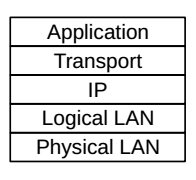
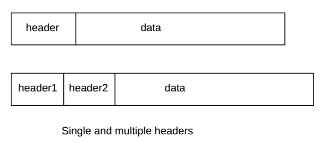
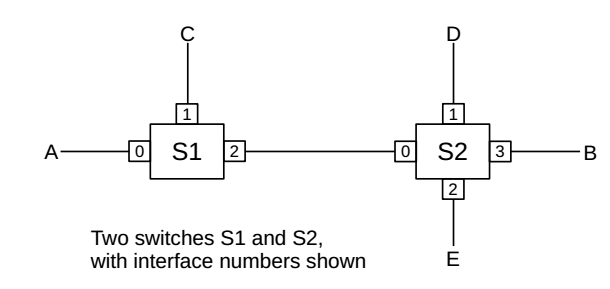
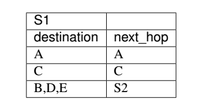
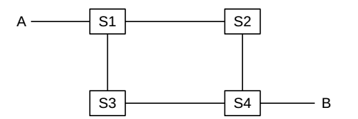

_Self study notes taken from lecture slides_

# Intro to Computer Networks Textbook
*2nd Edition, Sept 01, 2020*
*Author: Peter Dordal (Loyola University Chicago)*

1. An Overview of Networks
2. 
3. 

## Chapter 1: An Overview of Networks

### 1.1 Layers

Local Area Networks, or LANs, are the “physical” networks that provide the connection between machines within, say, a home, school or corporation. LANs are, as the name says, “local”; it is the IP, or Internet Protocol, layer that provides an abstraction for connecting multiple LANs into, well, the Internet. Finally, TCP deals with transport and connections and actually sending user data.

LANs, IP and TCP – are often called layers; they constitute the Link layer, the Internetwork layer, and the Transport layer respectively. Together with the Application layer (the software you use), these form the “four-layer model” for networks.

Dividing the LAN layer into physical/logical subdivision gives us the Internet five-layer model.

We will also introduce two more rather obscure layers that complete the seven-layer model.

### 1.2 Data Rate, Throughput and Bandwidth

Data rate
> the rate at which bits are transmitted. In some LANs (eg Wi-Fi) the data rate can vary with time. 

Throughput
> refers to the overall effective transmission rate, taking into account things like transmission overhead, protocol inefficiencies and perhaps even competing traffic.

Goodput
>  is sometimes used to refer to what might also be called “application-layer throughput”: the amount of usable data delivered to the receiving application.

Data rates are generally measured in kilobits per second (kbps) or megabits per second (Mbps); the use of the lower-case “b” here denotes bits. In contrast, data volumes are denoted using kB and MB, with the upper-case B denoting bytes.

### 1.3 Packets

Packets
> are modest-sized buffers of data, transmitted as a unit through some shared set of links.

Packets need to be prefixed with a **header** containing delivery information. In the common case known as **datagram forwarding**, the header contains a **destination address**. Almost all networking today is packet-based.

Maximum packet size supported by a given LAN (eg Ethernet, Token Ring or ATM) is an intrinsic attribute of that LAN. Ethernet allows a maximum of 1500 bytes of data. By comparison, TCP/IP packets originally often held only 512 bytes of data.

Generally each layer adds its own header. Ethernet headers are typically 14 bytes, IP headers 20 bytes, and TCP headers 20 bytes.

### 1.4 Datagram Forwarding

Switches or routers to look at the address in the packet's headers to get the packet to the correct destination.

In datagram forwarding this is achieved by providing each switch with a forwarding table of [destination,next_hop] pairs.

The switch also finds the **next_hop**
> the immediate-neighbor address to which – or interface by which – the packet should be forwarded in order to bring it one step closer to the final destination.The next_hop value in a forwarding table is a single entry; **each switch is responsible for only one step in the packet’s path**.

The “destination” entries in the forwarding table do not have to correspond exactly with the packet destination addresses, for Ethernet datagram forwarding they correspond. But for IP routing, the table “destination” entries will correspond to **prefixes** of IP addresses; this leads to a huge savings in space. The fundamental requirement is that the switch can perform a lookup operation, using its forwarding table and the destination address in the arriving packet, to determine the next hop.

A central feature of datagram forwarding is that each packet is forwarded “in isolation”; the switches involved do not have any awareness of any higher-layer logical connections established between endpoints. This is also called stateless forwarding, in that the forwarding tables have no per-connection state.

The fundamental alternative to datagram forwarding is **virtual circuits**
> In virtual-circuit networks, each router maintains state about each connection passing through it; different connections can be routed differently.

Switches
> devices acting at the LAN layer and forwarding packets based on the LAN address

Routers
> devices acting at the IP layer and forwarding on the IP address

Datagram forwarding is used both by Ethernet switches and by IP routers. The destinations in Ethernet forwarding tables are individual nodes while the destinations in IP routers are entire networks (that is, sets of nodes).

### 1.5 Topology

If there are no loops in a network graph/diagram then there is no redundancy: any broken link will result in partitioning the network into two pieces that cannot communicate. All else being equal (which it is not, but never mind for now), redundancy is a good thing.

Many LANs (in particular Ethernet) prefer “tree” networks with no redundancy, while IP has complex protocols in support of redundancy.

### 1.5.1 Traffic Enginner

Traffic engineering
> refer to any intentional selection of one route over another, or any elevation of the priority of one class of traffic.

Datagram forwarding can be extended to take quality-ofservice information into account; this may be used to have voice traffic – with its relatively low bandwidth but intolerance for delay – take an entirely different path than bulk file transfers.

The quality-of-service information may be set by the end-user, in which case an ISP may wish to recognize it only for designated users, which in turn means that the ISP will implicitly use the traffic source when making routing decisions. Alternatively, the quality-of-service information may be set by the ISP itself, based on its best guess as to the application;

### 1.6 Routing Loops

A potential drawback to datagram forwarding is the possibility of a **routing loop**:
>  a set of entries in the forwarding tables that cause some packets to circulate endlessly.

Routing loops typically arise because the creation of the forwarding tables is often “distributed”, and there is no global authority to detect inconsistencies. Even when there is such an authority, temporary routing loops can be created due to notification delays.

All datagram-forwarding protocols need some way of detecting and avoiding routing loops.

Ethernet, for example, avoids nonlinear routing loops by disallowing loops in the underlying network topology, and avoids linear routing loops by not having switches forward a packet back out the interface by which it arrived.

IP provides for a one-byte “Time to Live” (TTL) field in the IP header; decreases by 1 at each router, packet is discarded when TTL counter reaches 0. This limits the number of times a wayward packet can be forwarded to the initial TTL value, typically 64.

A switch is responsible only for the next hop to the ultimate destination; if a switch has a complete path in mind, there is no guarantee that the next_hop switch or any other downstream switch will continue to forward along that path.

### 1.7 Congestion

Congestion
> Switches introduce the possibility of congestion: packets arriving faster than they can be sent out.

Causes of congestion
- if the inbound interface has a higher bandwidth than the outbound interface
- traffic arriving on multiple inputs and all destined for the same output

A queue will form if packets arrive faster than they can be sent. If queue is full, packets will be **dropped**. 

### 1.8 Packets again

The main benefit of packets: The same link can carry, at different times, different packets representing traffic to different destinations and from different senders.

When a router or switch receives a packet, it reads in the entire packet before looking at the header and decide which node to forward it. THis is known as **Store and forward** and introduces a **forwarding delay** equal to time needed to read the entire packet. 

Total packet delay is the sum of: bandwidth delay (per link), propagation delay (speed of light), store-and-forward delay, queueing delay. 

### 1.9 LAN and Ethernet

Local Area Network
> physical links that are ultimately serial lines. common interfacing hardward connecting the hosts to the links. protocols to make everything work together.

The most common type of (wired) LAN is Ethernet, nowadays most Ethernet operates at 100 Mbps.

Due to both privacy and efficiency concerns, almost all Ethernets today are fully switched; this ensures that each packet is delivered only to the host to which it is addressed.

Ethernet also has a designated broadcast address. A host sending to the broadcast address has its packet received by every other host on the network; broadcast mechanism allows host A to contact host B when A does not yet know B’s physical address. 

Traffic addressed to a particular host – that is, not broadcast – is said to be unicast.

Switched Ethernet works quite well, however, for networks with up to 10,000-100,000 nodes. Forwarding tables (list of all node addresses) with size in that range are straightforward to manage.

### IP - Internet Protocol

To solve the scaling problem with Ethernet, the Internet Protocol was developed. IP was meant to support universal connectivity, without resulting in unmanageably large forwarding tables (currently the largest tables have 300,000 entries).

IP provides a global mechanism for **addressing and routing**, so that packets can actually be delivered from any host to any other host. IP addresses are part of the IP header. 

An essential feature of IP addresses is that they can be divided into a network part (prefix) and a host part (the remainder.)

IP addresses need to be assigned by administrative group. 

The network portion of an IP address is sometimes called the network number or network address or network prefix. As we shall see below, most forwarding decisions are made using only the network prefix.

All hosts with the same network address (same network bits) are said to be on the same IP network and must be located together on the same LAN; Thus we assume that if two hosts share the same network address they can reach each other directly.

IP is a best effort system; there are no IP-layer acknowledgments or retransmissions. We ship the packet and hope it gets there. best-effort model represents what is known as connectionless networking: the IP layer does not maintain information about endpoint-to-endpoint connections, and simply forwards packets like a giant LAN.

The alternative could have been some form connection-oriented internetworking, in which routers do maintain state information about individual connections.

Connectionless networking is conceptually more reliable: if routers do not hold connection state, then they cannot lose connection state. The primary advantage of connection-oriented networking, on the other hand, is that the routers are then much better positioned to accept reservations and to make quality-of-service guarantees. This is somewhat neglected in current internet. Packets are treated by the Internet just the same as any other file. No priority service option.

The most common form of IP packet loss is router queue overflows, representing network congestion. A large number of hosts can simultaneously attempt to send traffic through one router. 

### 1.10.1 IP Forwarding

The “destination” values listed in the forwarding tables of IP routers are network prefixes – representing entire LANs – instead of individual hosts. The goal of IP forwarding, then, becomes delivery to the correct LAN; A separate process is used to deliver to the final hosts once the final LAN is reached.

**Routers need to list only the network prefixes** of the destination addresses in their IP forwarding tables. This strategy is the key to IP scalability: it saves large amounts of forwarding-table space, it saves time as smaller tables allow faster lookup, and it saves the bandwidth and overhead that would be needed for routers to keep track of individual addresses.

(Page 26). 

(Page 26). 

(Page 26). 

(Page 26). 

(Page 26). 

(Page 26). 

(Page 26). 

(Page 25). 

(Page 25). 

(Page 25). 

(Page 25). 

(Page 24). 

(Page 24). 

(Page 24). 
(Page 23). 

(Page 23). 

(Page 23). 

(Page 23). 

(Page 23). 

(Page 23). 

(Page 22). 

(Page 22). 

(Page 21). 

(Page 20). 

(Page 20). 
(Page 20). 